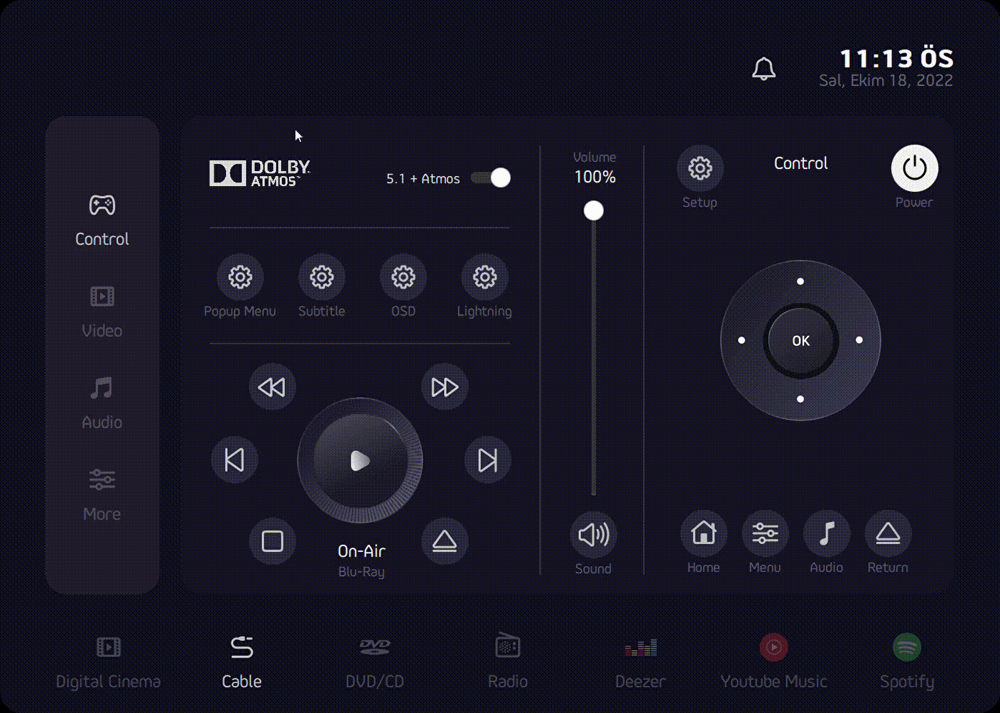

# Music Dashboard QML/C++  ?style=flat&logo=appveyor" alt="Awesome Badge"/> 

    Note: Bu proje tamamen bitmedi. ama yine de fikir için paylaşmaya değer.

Hello, this study is an output of the C++ and Qt Development Training I have presented.

Basically, it aims to create UI sketch work using modern C++ and Qt technologies (QtQuick/QML).

Based on a sketch by [Mohammad Reza Farahzad](https://dribbble.com/mrfarahzad) from the Dribble site.
Source: https://dribbble.com/shots/18925797-Remote-Control-App-Dark

QML App Output

Requirements
------------
* Qt 5.2 or later
* CMake 2.8.11 or later
* C++11 compiler

# Contact:
* Email: [mail@hakankaya.kim]
* Twitter: [@haknkayaa](https://twitter.com/haknkayaa)
